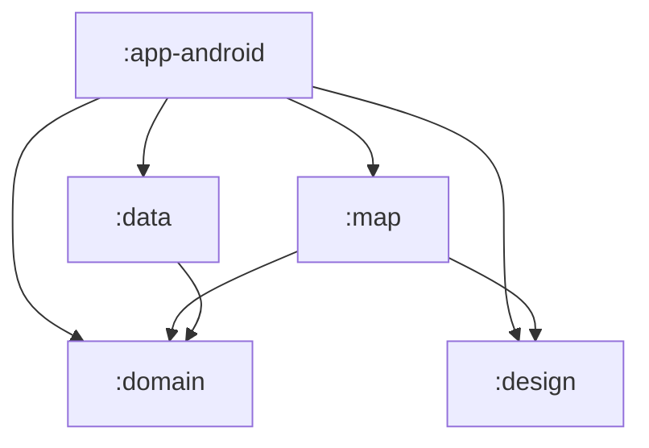
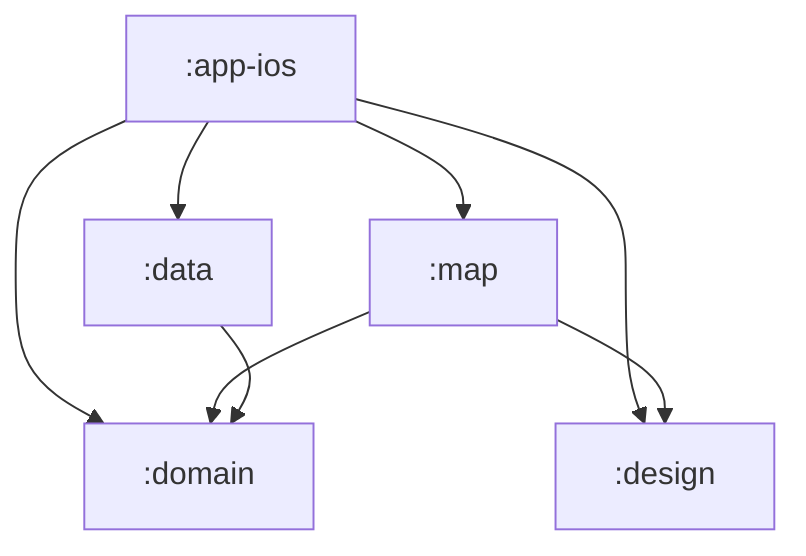

# Architecture

Feature-split Kotlin Multiplatform modules; Compose Multiplatform UI on Android + iOS.

| Module | Purpose |
|---|---|
| `:domain` | Pure-Kotlin domain models (`RegionId`, `MapDescriptor`, `MapPack`, `Visit`) and repository contracts. |
| `:data` | Room 3 visits store, map-pack loading from bundled resources, Koin `dataModule()`. |
| `:design` | Design system: `GlobeTheme` (Material 3), `MapPalette`. |
| `:map` | The map feature: maplibre-compose screen, visited/unvisited overlay layers, details sheet, `MapViewModel`, Koin `mapModule()`. |
| `:app-android` | Thin Android entry point + Koin composition root. |
| `:app-ios` | Thin iOS entry point (Kotlin framework + XcodeGen project) + Koin composition root. |

Key decisions:

- **Map rendering:** MapLibre Native via maplibre-compose (shared `commonMain` map UI),
  OpenFreeMap base styles (Positron in light mode, Dark in dark mode, following the
  system color scheme), no API key. The style JSONs are bundled pre-stripped by
  `scripts/strip-basemap-labels.py`: US state names (filtered by the map pack's region
  names) and country names remain, all other place labels (cities, towns, non-US
  provinces, continents) are removed; tiles/glyphs/sprites still stream from
  openfreemap.org. Visited-ness is rendered as two GeoJSON
  sources (visited/unvisited) recomputed by the ViewModel from Room state.
- **Map packs are data:** a descriptor JSON (regions, camera) + a GeoJSON
  FeatureCollection whose features carry a `code` property. `us-states` is the only pack
  in v1 and is hardcoded in `:map`.
- **Visits:** one Room row per visited region, keyed `(mapId, regionCode)`; row
  existence = visited; optional `visitedAt` date and `notes`.
- **Approximate location:** the "you are here" dot comes from the platform's location
  service at coarse/reduced accuracy (framework `LocationManager` on Android, CoreLocation
  at ~3 km on iOS) — state-level accuracy, no GPS precision requested. Denied permission
  simply means no dot.

## Dependency graph — Android app

## Dependency graph — iOS app

Feature modules depend on `:domain` contracts only; `:data` implementations are wired
in exclusively at the app-module Koin composition roots.
