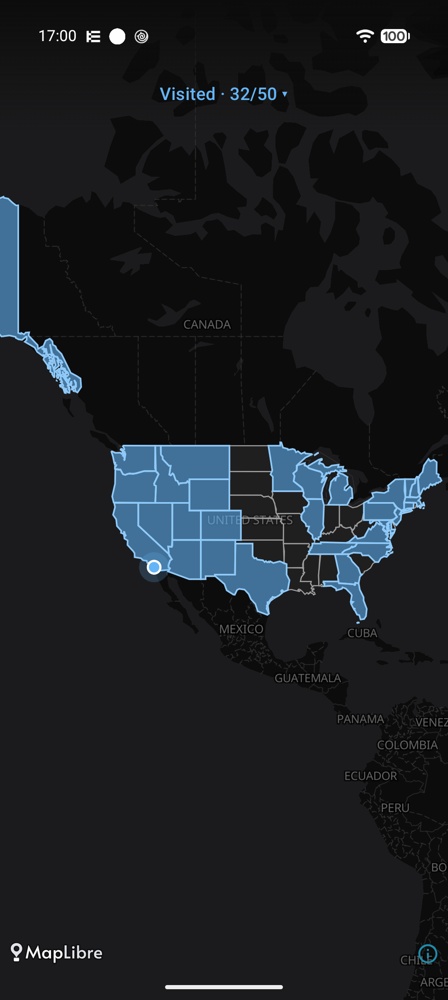

# GlobeTraveler

A Kotlin Multiplatform app (Android + iOS) for tracking which US states you've visited.
The whole interface is a pannable, zoomable map: tap a state to mark it visited (it
fills in green), long-press it to add a visit date and notes. Data stays on-device.

Maps are data-driven "map packs" (region descriptor + GeoJSON), so future maps —
counties in a state, countries of the world — are new data files, not new code.



## Build & run

**Android**

```
./gradlew :app-android:installDebug
```

**iOS**

```
cd app-ios
xcodegen
xcodebuild -project GlobeTraveler.xcodeproj -scheme GlobeTraveler \
  -destination 'platform=iOS Simulator,name=iPhone 16 Pro' build
```

**Tests**

```
./gradlew :domain:jvmTest :data:jvmTest :map:testDebugUnitTest
```

## Map data

Bundled from US Census 2010 cartographic boundaries (public domain). Regenerate with
`python3 scripts/build-mappack.py` — see `resources/geodata/README.md`.

## Architecture

See [ARCHITECTURE.md](ARCHITECTURE.md). Design spec and implementation plan live in
`docs/superpowers/`.
